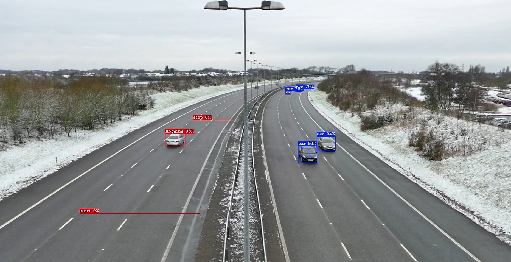
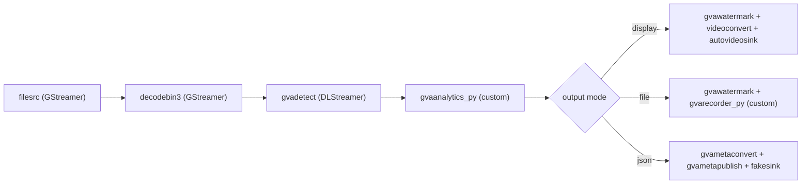

# Smart Network Video Recorder for Lane Hogging Detection

This sample demonstrates how to build a simple Network Video Recorder (NVR) with custom video analytics using DLStreamer elements.
It detects line-hogging events—vehicles driving in outer lanes without a neighboring vehicle—which may be illegal in certain jurisdictions.

> Note: This sample uses free stock video from [Pexels](https://www.pexels.com).



The event detection logic is straightforward and designed for demonstration purposes. 
This sample showcases how to integrate custom analytics and custom video storage into a DLStreamer pipeline composed of:


```mermaid
graph LR
        A["filesrc (GStreamer)"] --> B["decodebin3 (GStreamer)"]
        B --> C["gvadetect (DLStreamer)"]
        C --> D["gvaanalytics_py (custom)"]
        D --> E{output mode}
        E -->|display| F["gvawatermark + videoconvert + autovideosink"]
        E -->|file| G["gvawatermark + gvarecorder_py (custom)"]
        E -->|json| H["gvametaconvert + gvametapublish + fakesink"]
```

The sample uses the following set of pipeline elements: 

* __filesrc__ - GStreamer element that reads the video stream from a local file
* __decodebin3__ - GStreamer element that decodes the video stream into individual frames
* __gvadetect__ - DLStreamer inference element that detects vehicles using the RTDETRv2 model
* __gvaanalytics_py__ - Custom Python element that processes object detection results and identifies lane-hogging vehicles
* __gvawatermark__ - DLStreamer element that renders detection results and custom objects (lane-hogging vehicles) on video frames
* __gvarecorder_py__ - Custom Python element that segments the video into 10-second chunks and stores metadata for each segment (used in `file` output mode)
* __gvametaconvert / gvametapublish__ - DLStreamer elements that serialize detection metadata to JSON Lines format (used in `json` output mode)

## Prerequisites

### Install DLStreamer

#### Option A: Docker image (recommended)

Pull the latest DLStreamer image and start an interactive container with GPU access:

```sh
docker pull intel/dlstreamer:latest
docker run --init -it --rm \
    --device /dev/dri \
    --group-add $(stat -c "%g" /dev/dri/render*) \
    intel/dlstreamer:latest
cd /opt/intel/dlstreamer/samples/gstreamer/python/smart_nvr
```

> Note: install Docker Engine if not already available (see [Docker installation guide](https://docs.docker.com/engine/install/)).
> All subsequent commands run inside this container shell.

#### Option B: Native installation

Install DLStreamer on the host (see [DLStreamer Installation Guide](../../../../docs/user-guide/install/install_guide_index.md)).

```sh
cd samples/gstreamer/python/smart_nvr
```

### Download Video

Download example video file:

```sh
curl -L -o 2431853-hd_1920_1080_25fps.mp4 \
    "https://videos.pexels.com/video-files/2431853/2431853-hd_1920_1080_25fps.mp4"
```

### Prepare Model

This sample expects `PekingU/rtdetr_v2_r50vd` in FP16 precision from Hugging Face for vehicle detection.

Use the model conversion script in [scripts/download_models/](../../../../scripts/download_models/README.md) to prepare the model.
Before running it, create and activate the dedicated model-download virtual environment described in [scripts/download_models/README.md](../../../../scripts/download_models/README.md).

## Run Sample Application

```sh
python3 smart_nvr.py \
    --input 2431853-hd_1920_1080_25fps.mp4 \
    --model "MODELS_PATH/PekingU_rtdetr_v2_r50vd.xml"
```

Run `python3 smart_nvr.py --help` to see all available options.

### Output Modes

Control the output with `--output` (default: `display`):

| Mode | Device support | Description |
|---|---|---|
| `display` | CPU, GPU, NPU | Renders watermarked frames to screen via `videoconvert` + `autovideosink` |
| `file` | GPU (VA-API encoder); CPU/NPU require `openh264enc` | Segments video into MP4 chunks with per-chunk metadata files via `gvarecorder_py` |
| `json` | CPU, GPU, NPU | Writes detection metadata as JSON Lines to `output.json` via `gvametapublish` |

**Display (default):**
```sh
python3 smart_nvr.py --input video.mp4 --model model.xml --output display
```

**File recording** (use `--output-location` to set the output path, `--max-time` for chunk duration):
```sh
python3 smart_nvr.py --input video.mp4 --model model.xml --output file \
    --output-location output.mp4 --max-time 10
```

The sample generates output video chunks and corresponding metadata files:
```
output-00.txt  output-00.mp4
output-01.txt  output-01.mp4
...
```
Each metadata file lists the detected objects for that segment, e.g. `Objects: ['car', 'hogging', 'truck']`.
Search for `hogging` entries to find lane-hogging events, then review the matching MP4 segment.

**JSON metadata:**
```sh
python3 smart_nvr.py --input video.mp4 --model model.xml --output json
```
Outputs `output.json` in JSON Lines format, one record per frame.

## How It Works

### DLStreamer Pipeline Construction

The application creates a GStreamer `pipeline` object that combines predefined GStreamer and DLStreamer elements with custom Python elements. 
The pipeline is configured with the downloaded video file and detection model, and uses GPU inference by default.

```code
pipeline = Gst.parse_launch(
                f'filesrc location="{video_file}" ! decodebin3 ! '
                f'gvadetect model="{detection_model}" device={args.device} '
                f'batch-size={args.batch_size} threshold={args.threshold} ! queue ! '
                f'gvaanalytics_py distance=500 angle=-135,-45 ! queue ! '
                f'{sink}')  # sink depends on --output mode
```

### Custom Analytics Element

The `gvaanalytics_py` element is defined in `plugins/python/gvaAnalytics.py`.

This transform element processes GstAnalytics metadata generated by `gvadetect` and adds custom metadata. It implements the following logic:

- Detects cars or trucks crossing outer lanes (defined by the 'zone' polygon)
- For vehicles in the outer lane, checks for neighboring vehicles in the adjacent lane using 'distance' and 'angle' parameters
- Classifies vehicles with no neighboring traffic as lane-hogging and inserts a new "hogging" object into the metadata stream

### Custom Video File Storage Element

The `gvarecorder_py` element is defined in `plugins/python/gvaRecorder.py`.
It is a bin element that wraps a sequence of GStreamer elements into a sub-pipeline: 

```code
videoconvert -> vah264enc -> h264parse -> splitmuxsink
```

The element registers custom callbacks and signal handlers to process analytics metadata: 

```code
self.get_static_pad("sink").add_probe(Gst.PadProbeType.BUFFER, self.buffer_probe, 0)
self._filesink.get_static_pad("video").add_probe(Gst.PadProbeType.EVENT_DOWNSTREAM, self.event_probe, 0)
self._filesink.connect("format-location", self.format_location_callback, 0)
```

The `buffer_probe` callback collects object categories detected by upstream elements.

The `event_probe` callback handles end-of-stream events to store metadata for the last video segment. 

The `format_location_callback` is invoked when a new video segment starts. It writes the accumulated metadata to a file associated with that segment.

## See also
* [Samples overview](../../../README.md)

