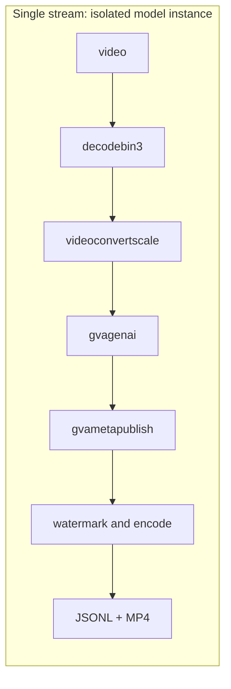
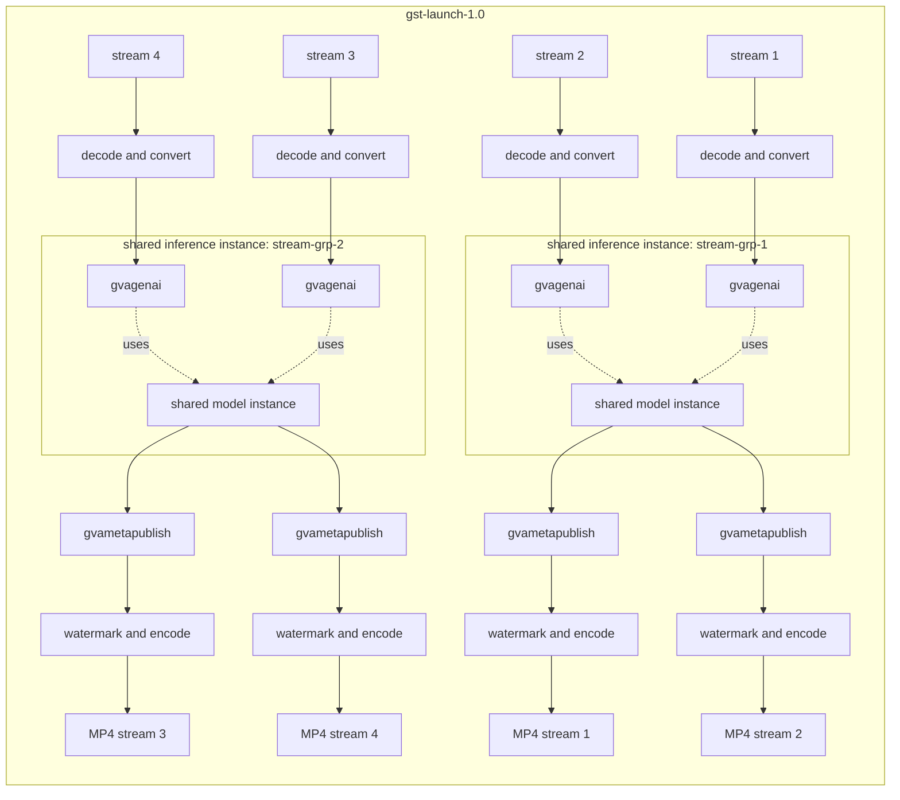

# VLM Alerts

This sample demonstrates an edge AI alerting pipeline using Vision-Language Models (VLMs).

It shows how to:

- Download a VLM from Hugging Face
- Convert it to OpenVINO IR using `optimum-cli`
- Run inference inside a DL Streamer pipeline
- Generate structured JSON alerts per processed frame, including a confidence score
- Produce MP4 output with the inference result overlaid on each frame
- Run a single video stream (default) or four streams grouped into two model-sharing groups

## Use Case: Alert-Based Monitoring

VLMs can help accurately detect rare or contextual events using natural language prompts — for example, detecting a police car in a traffic video.
This enables alerting for events, like in prompts:

- Is there a police car?
- Is there smoke or fire?
- Is a person lying on the ground?

## Model Preparation

Any image-text-to-text model supported by optimum-intel can be used. Smaller models (1B-4B parameters) are recommended for edge deployment. For example, OpenGVLab/InternVL3_5-2B.

The script runs:

```code
optimum-cli export openvino \
    --model <model_id> \
    --task image-text-to-text \
    --trust-remote-code \
    <output_dir>
```

Exported artifacts are stored under `models/<ModelName>/`. 
The export runs once and is cached. To skip export, pass `--model-path` directly.

## Video Preparation

Similarly to model, provide either:

- `--video-path` for a local file
- `--video-url` to download automatically

Both flags are repeatable; extra inputs are only used by the four-stream scenario
(**`--stream-groups`**). Downloaded videos are cached under **`videos/`**.

## Pipeline Architecture

The pipeline is built dynamically in Python using **`Gst.parse_launch`**. Two scenarios
are supported.

### Scenario 1 (default): single stream

One independent source, decoder, inference element, JSONL file, and MP4 file. Each
**`gvagenai`** loads its own isolated model instance.



### Scenario 2 (**`--stream-groups`**): four streams, two model-sharing groups

Four independent streams split into two groups of two:

- Streams 1 and 2 use **`model-instance-id=stream-grp-1`**
- Streams 3 and 4 use **`model-instance-id=stream-grp-2`**

Within each group, the two **`gvagenai`** elements share one loaded OpenVINO model instance;
inference calls on a shared instance are serialized, which reduces memory use but can
limit throughput. The two groups load separate model instances. Provide up to four inputs
by repeating **`--video-path`**/**`--video-url`**; if fewer are given, they are cycled to fill the
four streams.



Each stream has an independent source, decoder, inference element, and MP4
file. The branches run in one process and contain queues around the inference/output
stages.

## Setup

<u>1. Create and activate a virtual environment:</u>
```code
cd samples/gstreamer/python/vlm_alerts
uv venv --system-site-packages .vlm-venv
source .vlm-venv/bin/activate
```

**Note**:  The **`--system-site-packages`** flag is required so the virtual environment can
 use the GStreamer Python bindings (PyGObject / `gi`) provided by the system
 DL Streamer installation.

<u>2. Install dependencies:</u>
```code
curl -LO https://raw.githubusercontent.com/openvinotoolkit/openvino.genai/refs/heads/releases/2026/3/samples/export-requirements.txt
uv pip install -r export-requirements.txt
uv pip install -r requirements.txt
```

`requirements.txt` overrides two packages from `export-requirements.txt`:

- `transformers` must be compatible with `optimum-intel` for OpenVINO export.
- `openvino-tokenizers` must match the OpenVINO runtime used by DL Streamer to avoid binary incompatibility.

A DL Streamer build that includes the `gvagenai` element is required.

## Running

Required arguments:

- `--prompt`
- `--video-path` or `--video-url`
- `--model-id` or `--model-path`

### Single stream (default)

Run one video stream with an isolated model instance:

```code
python3 vlm_alerts.py \
    --video-url https://videos.pexels.com/video-files/2103099/2103099-hd_1280_720_60fps.mp4 \
    --model-id Phi-4-multimodal \
    --models-dir /home/dlstreamer/
    --prompt "Is there a police car? Answer yes or no."
```

### Four streams in two model-sharing groups

Use **`--stream-groups`** to run four video branches in one pipeline. Repeat
**`--video-path`** or **`--video-url`** to provide up to four inputs; if fewer are provided,
the inputs are cycled to fill all four streams. Each pair of **`gvagenai`** elements shares
one model instance: streams 1-2 use **`model-instance-id=stream-grp-1`**, and streams 3-4
use **`model-instance-id=stream-grp-2`**.

```code
python3 vlm_alerts.py \
    --stream-groups \
    --video-url https://videos.pexels.com/video-files/2103099/2103099-hd_1280_720_60fps.mp4 \
    --model-id OpenGVLab/InternVL3_5-2B \
    --prompt "Is there a police car? Answer yes or no."
```

Each stream writes `<ModelName>-<video_stem>-stream<N>.jsonl` and
`<ModelName>-<video_stem>-stream<N>.mp4`.

Optional arguments:

| Argument | Default | Description |
|---|---|---|
| `--stream-groups` | off | Run four streams split into two model-sharing groups of two, each group with its own `model-instance-id` |
| `--device` | `GPU` | Inference device |
| `--max-tokens` | `1` | Maximum tokens in the model response |
| `--num-beams` | `4` | Beam search width. Values ≥ 2 enable beam search and produce a confidence score; `1` means greedy decoding with no confidence |
| `--frame-rate` | `1.0` | Frames per second passed to `gvagenai` |
| `--videos-dir` | `./videos` | Directory for downloaded videos |
| `--models-dir` | `./models` | Directory for exported models |
| `--results-dir` | `./results` | Directory for output files |

## Output

Default single-stream scenario:

```
results/<ModelName>-<video_stem>.jsonl
results/<ModelName>-<video_stem>.mp4
```

Four-stream scenario (`--stream-groups`), one pair per stream:

```
results/<ModelName>-<video_stem>-stream<N>.jsonl
results/<ModelName>-<video_stem>-stream<N>.mp4
```

The `.jsonl` file contains one JSON record per processed frame. 
The `.mp4` file contains the processed video with the inference result and confidence percentage overlaid on every frame.

### Help

To display all available arguments and defaults:

```code
python3 vlm_alerts.py --help
```
