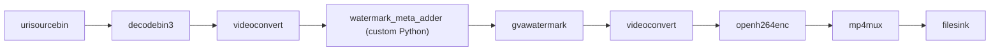

# Watermark Metadata Sample

This sample demonstrates how to attach custom drawing primitives to video frames using DLStreamer's
watermark metadata API (`WatermarkDrawMeta`, `WatermarkCircleMeta`, `WatermarkTextMeta`) and render
them with `gvawatermark`.

The sample creates a custom `GstBaseTransform` element in Python (`watermark_meta_adder`) that attaches
watermark metadata to each frame buffer. `gvawatermark` automatically reads and renders the metadata.



The sample attaches the following primitives to every frame:

| Primitive | Description |
|-----------|-------------|
| Green hexagon | `WatermarkDrawMeta` with 6 points |
| Red line | `WatermarkDrawMeta` with 2 points |
| Blue filled circle | `WatermarkCircleMeta` with `thickness=-1` |
| Yellow text with background | `WatermarkTextMeta` using TRIPLEX font |
| Cyan text without background | `WatermarkTextMeta` using PLAIN font |

## Running

### Prerequisites

DLStreamer must be installed. The `DLStreamerWatermarkMeta` GIR typelib must be on the
`GI_TYPELIB_PATH` (installed automatically with DLStreamer).

Install Python dependencies:

```sh
cd samples/gstreamer/python/watermark_meta
python3 -m venv .watermark_meta_venv
source .watermark_meta_venv/bin/activate
pip install -r requirements.txt
```

### Run the Sample

```bash
cd samples/gstreamer/python/watermark_meta
./watermark_meta.sh
```

Or specify custom input/output:

```bash
./watermark_meta.sh /path/to/input.mp4 /tmp/output.mp4
```

Default input: `https://videos.pexels.com/video-files/1192116/1192116-sd_640_360_30fps.mp4`  
Default output: `/tmp/watermark_meta_output.mp4`

### Run Directly with Python

```bash
python3 watermark_meta.py <INPUT_VIDEO_URI> <OUTPUT_MP4_FILE>
```

## How It Works

### Step 1 – Custom Element Attaches Metadata

`WatermarkMetaAdder` subclasses `GstBase.BaseTransform` and overrides `do_transform_ip`.
For every buffer it calls the `DLStreamerWatermarkMeta` GIR helpers:

```python
import gi
gi.require_version("DLStreamerWatermarkMeta", "1.0")
from gi.repository import DLStreamerWatermarkMeta

# Polygon
DLStreamerWatermarkMeta.draw_meta_add(
    buffer,
    [100, 50, 200, 50, 250, 150, 200, 250, 100, 250, 50, 150],
    r=0, g=200, b=0, thickness=3)

# Circle (filled)
DLStreamerWatermarkMeta.circle_meta_add(
    buffer, cx=570, cy=150, radius=50, r=30, g=80, b=220, thickness=-1)

# Text with background
DLStreamerWatermarkMeta.text_meta_add(
    buffer, x=50, y=300, text="DLStreamer watermark meta",
    font_scale=0.8, font_type=4, r=220, g=200, b=0, thickness=2, draw_bg=True)
```

### Step 2 – gvawatermark Renders the Metadata

`gvawatermark` automatically reads `WatermarkDrawMeta`, `WatermarkCircleMeta`, and
`WatermarkTextMeta` from the buffer and renders them alongside any standard inference metadata.

## Metadata API Reference

See [gvawatermark element documentation](../../../../docs/user-guide/elements/gvawatermark.md#watermark-metadata-api)
for the full API reference.

### `draw_meta_add(buffer, coords, r, g, b, thickness)`

Attaches a polygon or polyline. `coords` is a flat list `[x1, y1, x2, y2, ...]`.
Two points → line segment. Three or more points → closed polygon.

### `circle_meta_add(buffer, cx, cy, radius, r, g, b, thickness)`

Attaches a circle. Use `thickness=-1` for a filled circle.

### `text_meta_add(buffer, x, y, text, font_scale, font_type, r, g, b, thickness, draw_bg)`

Attaches a text label. `font_type` values correspond to OpenCV `cv::HersheyFonts`:
`0`=SIMPLEX, `1`=PLAIN, `2`=DUPLEX, `3`=COMPLEX, `4`=TRIPLEX.
`draw_bg=True` draws an opaque background behind the text.
