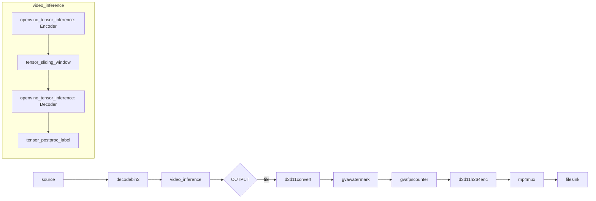

# Action Recognition Sample (Windows)

This sample demonstrates video action recognition using a two-stage deep learning model on Windows.

## How It Works

The sample uses a specialized architecture for temporal action recognition:

1. **Encoder Stage**: Extracts spatial features from video frames
2. **Sliding Window**: Accumulates temporal information across frames
3. **Decoder Stage**: Recognizes actions from temporal features

Pipeline elements:
- `filesrc` or `urisourcebin` for input
- `decodebin3` for video decoding
- `video_inference` bin with custom processing pipeline
- `openvino_tensor_inference` (2x) for encoder and decoder
- `tensor_sliding_window` for temporal accumulation
- `tensor_postproc_label` for action classification

## Models

- **action-recognition-0001-encoder** - Spatial feature extraction (MobileNet-based)
- **action-recognition-0001-decoder** - Temporal action classification (ConvGRU)

Trained on **Kinetics-400 dataset** (400 human action classes).

> **NOTE**: Run `download_omz_models.bat` before using this sample.

## Environment Variables

```batch
set MODELS_PATH=C:\models
```

## Running

```batch
action_recognition.bat [INPUT] [DEVICE] [OUTPUT] [JSON_FILE]
```

Arguments:
- **INPUT** (optional) - Input source (default: Pexels video URL)
- **DEVICE** (optional) - Inference device (default: CPU). Supported: CPU, GPU, NPU
- **OUTPUT** (optional) - Output type (default: file)
  - `file` - Save to MP4
  - `display` - Show video
  - `fps` - Benchmark
  - `json` - Export metadata
  - `display-and-json` - Show and export
- **JSON_FILE** (optional) - JSON output filename (default: output.json)

## Examples

### Recognize actions and save to file
```batch
action_recognition.bat C:\videos\sports.mp4 CPU file
```

### Display real-time recognition
```batch
action_recognition.bat C:\videos\sports.mp4 GPU display
```

### Export actions to JSON
```batch
action_recognition.bat C:\videos\sports.mp4 CPU json actions.json
```

### Benchmark performance
```batch
action_recognition.bat C:\videos\sports.mp4 GPU fps
```

## Kinetics-400 Action Classes

The model recognizes 400 actions including:

**Sports:** basketball, soccer, swimming, tennis, volleyball, golf, skiing, skating, surfing, boxing, wrestling, gymnastics, dancing, etc.

**Daily Activities:** cooking, eating, drinking, brushing teeth, washing hands, cleaning, ironing, folding clothes, reading, writing, etc.

**Music:** playing guitar, playing piano, playing drums, singing, etc.

**Transportation:** driving car, riding bike, riding horse, etc.

**Interactions:** shaking hands, hugging, kissing, high fiving, waving hand, etc.

Full list: See `kinetics_400.txt` in sample directory.

## Pipeline Architecture



## How It Works (Technical Details)

### Encoder
- Processes individual frames
- Extracts 512-dimensional feature vectors
- Runs on every input frame

### Sliding Window
- Buffers 16 consecutive feature vectors
- Slides with stride of 8 frames
- Provides temporal context to decoder

### Decoder
- Processes windowed feature sequences
- Uses ConvGRU for temporal modeling
- Outputs action probabilities (400 classes)

### Post-processing
- Applies softmax to get probabilities
- Maps to action labels from Kinetics-400
- Outputs top-1 predicted action

## Performance

Typical performance on Intel hardware:
- **CPU (Core i7)**: 20-30 FPS (720p)
- **GPU (Iris Xe)**: 50-80 FPS (720p)
- **GPU (Arc A770)**: 100-150 FPS (720p)

Input resolution: 224x224 (per frame)

## Performance Tips

1. **Use GPU device** for parallel encoder processing
2. **Lower video resolution** if FPS is insufficient
3. **Increase stride** in sliding window (edit pipeline) for faster but less accurate recognition
4. **Batch processing**: Process multiple videos in sequence

## Limitations

1. **Single person**: Model designed for single-person actions
2. **Full body**: Actions should show full body or most of body
3. **Video length**: At least 16 frames (~0.5 sec) for recognition
4. **Lighting**: Requires reasonable lighting conditions

## Troubleshooting

### Models not found
```batch
cd samples\windows
download_omz_models.bat
```

### No action detected
- Ensure video contains recognizable actions from Kinetics-400
- Check if action is visible for at least 0.5 seconds
- Verify sufficient video quality

### Low FPS
- Use GPU device
- Reduce input video resolution
- Check system resource usage

### Incorrect classifications
- Verify action is in Kinetics-400 list
- Ensure clear visibility of action
- Check lighting and camera angle

## Advanced Usage

### Custom Labels
Replace `kinetics_400.txt` with custom label file for different action datasets.

### Modify Temporal Window
Edit the pipeline's `tensor_sliding_window` parameters:
- Window size: Number of frames to accumulate
- Stride: Frame step between windows

### Integration
The JSON output can be integrated with:
- Video analytics systems
- Security monitoring
- Sports analysis tools
- Activity logging systems
