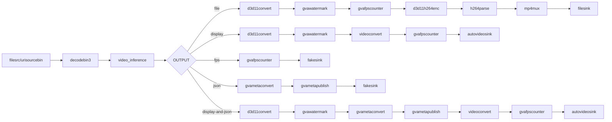

# Action Recognition Sample (Windows)

This sample demonstrates video action recognition using a two-stage deep learning model on Windows.

## How It Works

The sample uses a specialized architecture for temporal action recognition:

1. **Encoder Stage**: Extracts spatial features from video frames
2. **Sliding Window**: Accumulates temporal information across frames
3. **Decoder Stage**: Recognizes actions from temporal features

Pipeline elements:
- `filesrc` or `urisourcebin` for input
- `decodebin3` for video decoding
- `video_inference` bin with custom processing pipeline
- `openvino_tensor_inference` (2x) for encoder and decoder
- `tensor_sliding_window` for temporal accumulation
- `tensor_postproc_label` for action classification

## Models

- **action-recognition-0001-encoder** - Spatial feature extraction (MobileNet-based)
- **action-recognition-0001-decoder** - Temporal action classification (ConvGRU)

Trained on **Kinetics-400 dataset** (400 human action classes).

> **NOTE**: Run `download_omz_models.bat` before using this sample.

## Environment Variables

```powershell
set MODELS_PATH=C:\models\models
```

Models should be located at:
- Encoder: `%MODELS_PATH%\intel\action-recognition-0001\action-recognition-0001-encoder\FP32\action-recognition-0001-encoder.xml`
- Decoder: `%MODELS_PATH%\intel\action-recognition-0001\action-recognition-0001-decoder\FP32\action-recognition-0001-decoder.xml`

## Running

```powershell
.\action_recognition.bat [INPUT] [DEVICE] [OUTPUT] [JSON_FILE]
```

Arguments:
- **INPUT** - Input source (default: `https://videos.pexels.com/video-files/5144823/5144823-uhd_3840_2160_25fps.mp4`)
  - Local file path (e.g., `C:\videos\example.mp4`)
  - URL (e.g., `https://...`)
- **DEVICE** - Inference device (default: `CPU`)
  - Supported: `CPU`, `GPU`, `NPU`
- **OUTPUT** - Output type (default: `file`)
  - `file` - Save to MP4 with watermark and FPS counter
  - `display` - Display video with overlay
  - `fps` - Benchmark mode (no display)
  - `json` - Export metadata to JSON
  - `display-and-json` - Display and export metadata
- **JSON_FILE** - JSON output filename (default: `output.json`)

## Examples

### Use default settings (Pexels video, CPU, save to file)
```powershell
.\action_recognition.bat
```

### Recognize actions from local video and save to file
```powershell
.\action_recognition.bat "C:\videos\example.mp4" CPU file
```

### Display real-time recognition on GPU
```powershell
.\action_recognition.bat "C:\videos\example.mp4" GPU display
```

### Export actions to JSON
```powershell
.\action_recognition.bat "C:\videos\example.mp4" CPU json actions.json
```

### Benchmark FPS on NPU
```powershell
.\action_recognition.bat "C:\videos\example.mp4" NPU fps
```

## Kinetics-400 Action Classes

The model recognizes 400 actions including:

**Sports:** basketball, soccer, swimming, tennis, volleyball, golf, skiing, skating, surfing, boxing, wrestling, gymnastics, dancing, etc.

**Daily Activities:** cooking, eating, drinking, brushing teeth, washing hands, cleaning, ironing, folding clothes, reading, writing, etc.

**Music:** playing guitar, playing piano, playing drums, singing, etc.

**Transportation:** driving car, riding bike, riding horse, etc.

**Interactions:** shaking hands, hugging, kissing, high fiving, waving hand, etc.

Full list: See `kinetics_400.txt` in sample directory.

## Pipeline Architecture



## See also
* [Windows Samples overview](../../../README.md)
* [Linux Action Recognition Sample](../../../../gstreamer/gst_launch/action_recognition/README.md)

