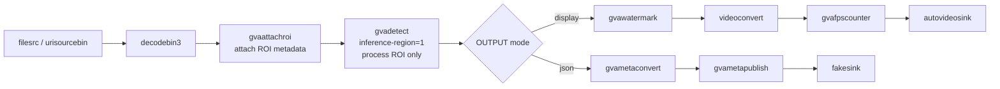

# GVAAttachROI Sample (gst-launch command line)

This README documents the Windows `gvaattachroi_sample.ps1` script, demonstrating the `gvaattachroi` element for defining regions of interest (ROI) for selective inference.

## How It Works

The script builds and runs a GStreamer pipeline with `gst-launch-1.0`. It demonstrates using ROIs to restrict inference to specific areas of the video frame, which is particularly useful for:
- Monitoring specific areas (e.g., a road in a city camera feed)
- Processing only relevant parts of large images
- Improving performance by reducing inference area

Key elements in the pipeline:
- `urisourcebin` or `filesrc` + `decodebin3`: input and decoding
- `gvaattachroi`: attaches ROI metadata to frames (defining areas of interest)
- `gvadetect`: runs object detection only within ROIs (`inference-region=1`)
- Output:
  - `gvametaconvert` + `gvametapublish`: write metadata to `output.json` (JSON Lines)
  - or `autovideosink`: on-screen rendering with FPS counter

## Pipeline Architecture

This pipeline demonstrates DL Streamer ROI-based inference workflow: gvaattachroi defines spatial regions, and gvadetect processes only those regions.



## Models

The sample uses YOLOv8s model (or other supported YOLO variants) from MODELS_PATH.

## ROI Definition

### Method 1: ROI Coordinates (Command-line)

Specify ROI coordinates directly as a parameter:

```PowerShell
.\gvaattachroi_sample.ps1 -RoiCoords "100,150,540,360"
```

Format: `x_top_left,y_top_left,x_bottom_right,y_bottom_right`

Example coordinates for a 640x360 video:
- Top-left corner: (100, 150)
- Bottom-right corner: (540, 360)

### Method 2: ROI List File (JSON)

Use a JSON file to define multiple ROIs. See the example `roi_list.json` file in the current directory for the format and structure.

**ROI Properties:**
- `x`, `y`: Top-left corner coordinates (in pixels)
- `width`, `height`: ROI dimensions (in pixels)
- `label` (optional): Descriptive name for the ROI

## Usage

```PowerShell
.\gvaattachroi_sample.ps1 [-InputSource <path>] [-Device <device>] [-OutputType <type>] [-RoiCoords <coords>] [-Model <model>] [-Precision <precision>] [-FrameLimiter <element>]
```

### Parameters

| Parameter | Default | Description |
|-----------|---------|-------------|
| -InputSource | DEFAULT | Local file path or URI. Use 'DEFAULT' for built-in sample video |
| -Device | CPU | Inference device: CPU, GPU, NPU |
| -OutputType | display | Output type: display, json, fps, display-and-json |
| -RoiCoords | (empty) | ROI coordinates: x_top_left,y_top_left,x_bottom_right,y_bottom_right |
| -Model | yolov8s | Model name (from MODELS_PATH/public/) |
| -Precision | FP32 | Model precision: FP32, FP16, INT8 |
| -FrameLimiter | (empty) | Optional GStreamer element to insert after decode (e.g., " ! identity eos-after=1000") |

Notes:
- If `-RoiCoords` is not specified, the script uses `roi_list.json` file.
- The script converts paths to forward slashes for GStreamer.

## Examples

- Use ROI list file (default):
```PowerShell
$env:MODELS_PATH = "C:\models"
.\gvaattachroi_sample.ps1
```

- Specify ROI coordinates directly:
```PowerShell
$env:MODELS_PATH = "C:\models"
.\gvaattachroi_sample.ps1 -RoiCoords "100,150,540,360"
```

- GPU with custom video and JSON output:
```PowerShell
$env:MODELS_PATH = "C:\models"
.\gvaattachroi_sample.ps1 -InputSource C:\videos\traffic.mp4 -Device GPU -OutputType json -RoiCoords "200,100,600,400"
```

- Multiple ROIs from file, display output:
```PowerShell
$env:MODELS_PATH = "C:\models"
.\gvaattachroi_sample.ps1 -InputSource C:\videos\cityview.mp4 -Device CPU -OutputType display
```

- Process only first 1000 frames (for testing):
```PowerShell
.\gvaattachroi_sample.ps1 -OutputType json -FrameLimiter " ! identity eos-after=1000"
```

- Use different model:
```PowerShell
.\gvaattachroi_sample.ps1 -Model yolo11s -Precision FP16 -Device GPU
```

- NPU device with INT8 model:
```PowerShell
.\gvaattachroi_sample.ps1 -Device NPU -Model yolov8s -Precision INT8 -OutputType json
```

## Understanding ROI Coordinates

### Visual Example

For a 640x360 video frame:

```
(0,0) ─────────────────────────────────────── (640,0)
  │                                                │
  │     ROI 1: (100,150) ┌─────────┐              │
  │                      │         │              │
  │                      │  Road   │              │
  │                      └─────────┘ (540,360)    │
  │                                                │
(0,360) ───────────────────────────────────── (640,360)
```

**ROI Command:** `-RoiCoords "100,150,540,360"`

This defines a region from (100,150) to (540,360), covering approximately the center 70% of the frame horizontally.

### Choosing ROI Coordinates

1. **Identify area of interest** in your video (e.g., road, doorway, counter)
2. **Estimate pixel coordinates** - use a video player with coordinate display, or a screenshot tool
3. **Test and adjust** - run with `-OutputType display` to visualize ROI placement

**Tips:**
- Start with a larger ROI and refine
- Use `roi_list.json` for multiple ROIs
- ROI should cover the area where objects of interest appear

## Output

- **JSON mode**: writes metadata to `output.json` (JSON Lines format) including ROI information and detections within ROIs.
- **Display mode**: renders via `autovideosink` with bounding boxes and ROI visualization.
- **FPS mode**: only prints FPS statistics.
- **Display-and-JSON mode**: combines display and JSON output.

## Example JSON Output

```json
{
  "frame_id": 10,
  "regions": [
    {
      "roi": {"x": 100, "y": 150, "width": 440, "height": 210, "label": "road"},
      "detections": [
        {"label": "car", "confidence": 0.95, "x": 250, "y": 200, "width": 80, "height": 60},
        {"label": "person", "confidence": 0.88, "x": 180, "y": 220, "width": 40, "height": 80}
      ]
    }
  ]
}
```

## Editing roi_list.json

To modify ROIs, edit the `roi_list.json` file in the current directory. The file contains example ROI definitions that you can customize for your specific use case.

## Use Cases

### 1. Traffic Monitoring
Monitor only the road area, ignoring sidewalks and buildings:
```PowerShell
.\gvaattachroi_sample.ps1 -InputSource C:\videos\traffic_cam.mp4 -RoiCoords "100,200,540,350"
```

### 2. Retail Analytics
Monitor checkout counters, ignoring aisles. Define multiple ROIs in `roi_list.json` for different counter areas.

## See also

* [Windows Samples overview](../../../README.md)
* [Linux GVAAttachROI Sample](../../../../gstreamer/gst_launch/gvaattachroi/README.md)
