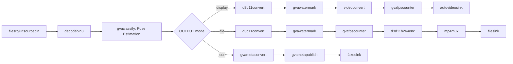

# Human Pose Estimation Sample (Windows)

This sample demonstrates human pose estimation using the `gvaclassify` element with full-frame inference on Windows.

## How It Works

The sample builds a GStreamer pipeline using:
- `filesrc` or `urisourcebin` for input from file/URL
- `decodebin3` for video decoding
- [gvaclassify](https://dlstreamer.github.io/elements/gvaclassify.html) with `inference-region=full-frame` for human pose estimation
- [gvawatermark](https://dlstreamer.github.io/elements/gvawatermark.html) for visualization of pose keypoints
- `d3d11convert` for D3D11-accelerated video conversion
- `autovideosink` for rendering output video to screen

## Models

The sample uses the following pre-trained model from OpenVINO™ Toolkit [Open Model Zoo](https://github.com/openvinotoolkit/open_model_zoo):
- **human-pose-estimation-0001** - Single person pose estimation network

> **NOTE**: Before running this sample, run `download_omz_models.bat` once (located in `samples\windows` folder) to download all required models.

## Environment Variables

This sample requires the following environment variable to be set:
- `MODELS_PATH`: Path to the models directory

Example:
```batch
set MODELS_PATH=C:\models
```

## Running

```batch
human_pose_estimation.bat [INPUT] [DEVICE] [OUTPUT] [JSON_FILE]
```

Arguments:
- **INPUT** (optional) - Input source (default: GitHub sample video URL)
  - Local file: `C:\videos\video.mp4`
  - URL: `https://example.com/video.mp4`
- **DEVICE** (optional) - Device for inference (default: CPU)
  - Supported: CPU, GPU, NPU
- **OUTPUT** (optional) - Output type (default: display)
  - `display` - Show video with pose overlay
  - `file` - Save to MP4 file
  - `fps` - Print FPS only
  - `json` - Export metadata to JSON
  - `display-and-json` - Show video and save JSON
- **JSON_FILE** (optional) - JSON output filename (default: output.json)

## Examples

### Display with CPU inference
```batch
human_pose_estimation.bat C:\videos\walking.mp4 CPU display
```

### Save to file with GPU inference
```batch
human_pose_estimation.bat C:\videos\walking.mp4 GPU file
```

### Export metadata to JSON
```batch
human_pose_estimation.bat C:\videos\walking.mp4 CPU json pose_results.json
```

### Use default video from internet
```batch
human_pose_estimation.bat
```

## Pipeline Architecture



## Output

The human pose estimation model detects 18 keypoints for a single person:
1. Nose
2. Neck
3. Right shoulder
4. Right elbow
5. Right wrist
6. Left shoulder
7. Left elbow
8. Left wrist
9. Right hip
10. Right knee
11. Right ankle
12. Left hip
13. Left knee
14. Left ankle
15. Right eye
16. Left eye
17. Right ear
18. Left ear

## Notes

- Windows-specific elements:
  - Uses `d3d11convert` for GPU acceleration (instead of Linux `vapostproc`)
  - Uses `d3d11h264enc` for video encoding (instead of Linux `vah264enc`)
  - Preprocessing backend: `opencv` for CPU, `d3d11` for GPU/NPU
- The `sync=false` property in video sink runs pipeline as fast as possible
- For real-time playback, change to `sync=true`
