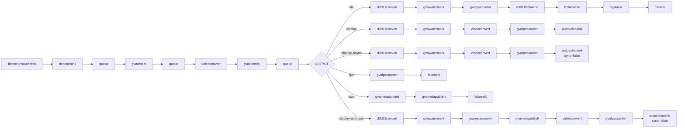

# License Plate Recognition Sample (Windows)

This sample demonstrates automatic license plate detection and OCR (Optical Character Recognition) on Windows.

## How It Works

The sample uses a two-stage cascaded inference pipeline:
1. **Detection Stage**: YOLOv8 detects license plates in video frames
2. **Recognition Stage**: PaddleOCR recognizes characters on detected plates

Pipeline elements:
- `filesrc` or `urisourcebin` for input
- `decodebin3` for video decoding
- `gvadetect` for license plate detection
- `gvaclassify` for OCR
- `gvawatermark` for visualization

## Models

- **yolov8_license_plate_detector** - YOLOv8-based license plate detector
- **ch_PP-OCRv4_rec_infer** - PaddlePaddle OCR V4 recognition model

> **NOTE**: Run `download_public_models.bat` before using this sample.

## Environment Variables

```PowerShell
$set MODELS_PATH=C:\models\models
```

Models should be located at:
- `%MODELS_PATH%\public\yolov8_license_plate_detector\FP32\yolov8_license_plate_detector.xml`
- `%MODELS_PATH%\public\ch_PP-OCRv4_rec_infer\FP32\ch_PP-OCRv4_rec_infer.xml`

## Running

```PowerShell
.\license_plate_recognition.bat [INPUT] [DEVICE] [OUTPUT] [JSON_FILE]
```

Arguments:
- **INPUT** - Input source (default: `https://github.com/open-edge-platform/edge-ai-resources/raw/main/videos/ParkingVideo.mp4`)
  - Local file path (e.g., `C:\videos\parking.mp4`)
  - URL (e.g., `https://...`)
- **DEVICE** - Inference device (default: `GPU`)
  - Supported: `CPU`, `GPU`, `NPU`
- **OUTPUT** - Output type (default: `fps`)
  - `display` - Show video with overlay (sync)
  - `display-async` - Show video with overlay (async, faster)
  - `fps` - Benchmark mode (no display)
  - `json` - Export metadata to JSON
  - `display-and-json` - Display and export
  - `file` - Save to MP4 file
- **JSON_FILE** - JSON output filename (default: `output.json`)

## Examples

### Use default settings (GitHub video, GPU, benchmark mode)
```PowerShell
.\license_plate_recognition.bat
```

### Display with real-time visualization
```PowerShell
.\license_plate_recognition.bat "C:\videos\parking.mp4" GPU display-async
```

### Export recognized plates to JSON
```PowerShell
.\license_plate_recognition.bat "C:\videos\parking.mp4" GPU json plates.json
```

### Benchmark performance on CPU
```PowerShell
.\license_plate_recognition.bat "C:\videos\parking.mp4" CPU fps
```

### Run on NPU with display
```PowerShell
.\license_plate_recognition.bat "C:\videos\parking.mp4" NPU display-async
```

### Save annotated video
```PowerShell
.\license_plate_recognition.bat "C:\videos\parking.mp4" GPU file
```

## Performance Tips

1. **Use GPU or NPU for best performance** - Hardware acceleration significantly speeds up both detection and OCR
2. **Use `display-async` instead of `display`** - Async mode improves frame rate
3. **Pre-process backend**:
   - CPU: Uses OpenCV (software)
   - GPU/NPU: Uses D3D11 (hardware accelerated)

## Pipeline Architecture



## See also
* [Windows Samples overview](../../../README.md)
* [Linux License Plate Recognition Sample](../../../../gstreamer/gst_launch/license_plate_recognition/README.md)
