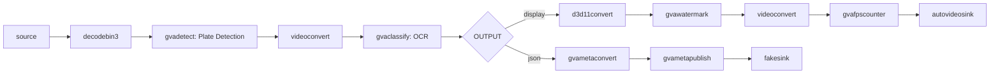

# License Plate Recognition Sample (Windows)

This sample demonstrates automatic license plate detection and OCR (Optical Character Recognition) on Windows.

## How It Works

The sample uses a two-stage cascaded inference pipeline:
1. **Detection Stage**: YOLOv8 detects license plates in video frames
2. **Recognition Stage**: PaddleOCR recognizes characters on detected plates

Pipeline elements:
- `filesrc` or `urisourcebin` for input
- `decodebin3` for video decoding
- [gvadetect](https://dlstreamer.github.io/elements/gvadetect.html) for license plate detection
- [gvaclassify](https://dlstreamer.github.io/elements/gvaclassify.html) for OCR
- [gvawatermark](https://dlstreamer.github.io/elements/gvawatermark.html) for visualization

## Models

- **yolov8_license_plate_detector** - YOLOv8-based license plate detector
- **ch_PP-OCRv4_rec_infer** - PaddlePaddle OCR V4 recognition model

> **NOTE**: Run `download_public_models.bat` before using this sample.

## Environment Variables

```batch
set MODELS_PATH=C:\models
```

## Running

```batch
license_plate_recognition.bat [INPUT] [DEVICE] [OUTPUT] [JSON_FILE]
```

Arguments:
- **INPUT** (optional) - Input source (default: GitHub parking video)
- **DEVICE** (optional) - Inference device (default: GPU). Supported: CPU, GPU
- **OUTPUT** (optional) - Output type (default: fps)
  - `display` - Show video (sync)
  - `display-async` - Show video (async, faster)
  - `fps` - Benchmark only
  - `json` - Export metadata
  - `display-and-json` - Show and export
  - `file` - Save to MP4
- **JSON_FILE** (optional) - JSON output filename (default: output.json)

## Examples

### Display with real-time visualization
```batch
license_plate_recognition.bat C:\videos\parking.mp4 GPU display-async
```

### Export recognized plates to JSON
```batch
license_plate_recognition.bat C:\videos\parking.mp4 GPU json plates.json
```

### Benchmark performance
```batch
license_plate_recognition.bat C:\videos\parking.mp4 GPU fps
```

### Save annotated video
```batch
license_plate_recognition.bat C:\videos\parking.mp4 GPU file
```

### Use CPU inference
```batch
license_plate_recognition.bat C:\videos\parking.mp4 CPU display
```

## Pipeline Architecture



## Output Format

JSON output contains:
```json
{
  "objects": [
    {
      "detection": {
        "bounding_box": {
          "x_min": 0.45,
          "y_min": 0.32,
          "x_max": 0.58,
          "y_max": 0.39
        },
        "confidence": 0.95,
        "label": "license_plate"
      },
      "classification": {
        "label": "ABC1234",
        "confidence": 0.88
      }
    }
  ]
}
```

## Supported Languages

The PaddleOCR model supports multiple languages:
- English
- Chinese
- Numbers
- Special characters (-, space, etc.)

## Performance

Typical performance on Intel hardware:
- **CPU (Core i7)**: 15-25 FPS
- **GPU (Iris Xe)**: 40-60 FPS
- **GPU (Arc A770)**: 80-120 FPS

## Performance Tips

1. **Use GPU device** for best performance
2. **Preprocessing backend**: 
   - CPU: `opencv`
   - GPU: `d3d11` (zero-copy)
3. **Lower input resolution** if FPS is low
4. **Limit detection ROI** to known plate locations

## Troubleshooting

### Models not found
```batch
cd samples\windows
download_public_models.bat
```

### Poor OCR accuracy
- Ensure good lighting in video
- Check if plates are visible at sufficient resolution
- Adjust detection confidence threshold

### Low FPS
- Use GPU device
- Reduce video resolution
- Check system load

### No detections
- Verify video contains license plates
- Adjust detection threshold
- Check model compatibility with plate format
