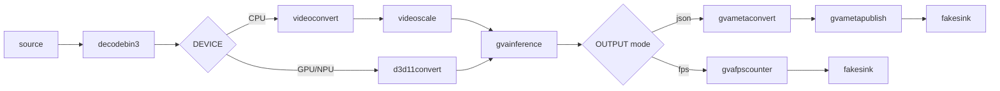

# Image Embeddings Generation with ViT (gst-launch command line)

This sample demonstrates the use of Vision Transformer (ViT) in a pipeline constructed via `gst-launch-1.0` command-line utility. It allows the extraction of image embeddings (CLS tokens) for each frame using the Vision Transformer extracted from a CLIP model.

## How It Works

The sample utilizes GStreamer command-line tool `gst-launch-1.0` which can build and run a GStreamer pipeline described in a string format.
The string contains a list of GStreamer elements separated by an exclamation mark `!`, each element may have properties specified in the format `property=value`.

This sample builds a GStreamer pipeline of the following elements:

**Input**: `filesrc` or `urisourcebin` (automatically detected).
**Decoding**: `decodebin3` for hardware/software video decoding.
**Preprocessing**:
- **CPU**: `videoconvert` and `videoscale` (OpenCV backend).
- **GPU**: `d3d11convert` (D3D11 backend).
- **NPU**: `d3d11convert` (D3D11 backend).
**Inference**: `gvainference` running the CLIP Vision Transformer model.
**Metadata**: `gvametaconvert` (JSON with tensor data) and gvametapublish (file output).
**Sink**: `fakesink` (default) or `gvafpscounter` for performance measurement.

## Model
The sample uses the following models with OpenVINO™ format:
- [`clip-vit-large-patch14`](https://huggingface.co/openai/clip-vit-large-patch14)
- [`clip-vit-base-patch16`](https://huggingface.co/openai/clip-vit-base-patch16)
- [`clip-vit-base-patch32`](https://huggingface.co/openai/clip-vit-base-patch32)

## Pipeline Architecture
This pipeline extracts image embeddings using a Vision Transformer (ViT) from a CLIP model. After decoding, `gvainference` extracts the high-dimensional feature vectors (embeddings) from each frame. The data flow is determined by the `OUTPUT` parameter, supporting either JSON metadata extraction or FPS performance benchmarking.



## Running
### Prerequisites
```powershell
set MODELS_PATH=C:\path\to\your\models
```
### Command Line Arguments
```powershell
.\generate_frame_embedding.bat [SOURCE] [DEVICE] [PRECISION] [MODEL] [PPBKEND] [OUTPUT]
```

The sample takes four command-line *optional* parameters:

| # | Argument | Description | Default |
| :--- | :--- | :--- | :--- |
| 1 | SOURCE | Local file path or HTTPS URL | Pexels Video URL |
| 2 | DEVICE | `CPU`, `GPU`, or `NPU` | `CPU` |
| 3 | PRECISION | `FP32`, `FP16`, or `INT8` | `FP32` |
| 4 | MODEL | CLIP model name (see above) | `clip-vit-large-patch14` |
| 5 | PPBKEND | `opencv` (CPU) or `d3d11` (GPU/NPU) | `opencv` |
| 6 | OUTPUT | `json` (save embeddings) or `fps` (benchmark) | `json` |

## Sample Output

The sample:

* prints the `gst-launch-1.0` full command line into the console
* starts the command and either publishes metadata to a file or prints out FPS if you set OUTPUT=fps

## See also

* [Samples overview](../../README.md)

## Example Usage

Default execution (CPU, FP32, JSON output):
```powershell
.\generate_frame_embeddings.bat
```

High-performance GPU inference (Intel® Arc™ GPU, FP16):
```powershell
.\generate_frame_embedding.bat "C:\you\video\path\sample.mp4" GPU FP16 clip-vit-large-patch14 d3d11 json
```

Benchmark throughput (FPS mode):
```powershell
.\generate_frame_embedding.bat https://example.com/stream.mp4 CPU FP32 clip-vit-base-patch32 opencv fps
```
