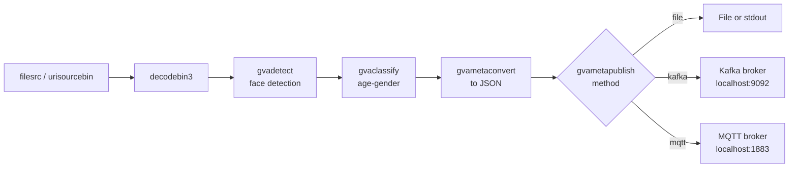

# Metadata Publishing Sample (gst-launch command line)

This sample demonstrates how [gvametaconvert](../../../../docs/user-guide/elements/gvametaconvert.md) and [gvametapublish](../../../../docs/user-guide/elements/gvametapublish.md) elements are used in a typical pipeline constructed with Deep Learning Streamer (DL Streamer) and GStreamer elements. By placing these elements to the end of a pipeline that performs face detection and age-gender classification, you will quickly see how these elements enable publishing of pipeline metadata to an output file, in-memory fifo, or a popular message bus.

These elements are useful for cases where you need to record outcomes (e.g., emitting inferences) of your DL Streamer pipeline to applications running locally or across distributed systems.

## How It Works

The sample utilizes GStreamer command-line tool `gst-launch-1.0` which can build and run GStreamer pipeline described in a string format.
The string contains a list of GStreamer elements separated by exclamation mark `!`, each element may have properties specified in the format `property`=`value`.

Overall this sample builds GStreamer pipeline of the following elements:
* `filesrc` or `urisourcebin` for input from file/URL
* `decodebin3` for video decoding
* [gvadetect](../../../../docs/user-guide/elements/gvadetect.md) for detecting faces using the OpenVINO™ Toolkit Inference Engine
* [gvaclassify](../../../../docs/user-guide/elements/gvaclassify.md) for recognizing the age and gender of detected faces using the OpenVINO™ Toolkit Inference Engine
* [gvametaconvert](../../../../docs/user-guide/elements/gvametaconvert.md) for conversion of tensor and inference metadata to JSON format
* [gvametapublish](../../../../docs/user-guide/elements/gvametapublish.md) for publishing the JSON metadata as output to console, file, MQTT or Kafka
* `fakesink` to terminate the pipeline output without actually rendering video frames

## Pipeline Architecture



> **NOTE**: The sample sets property 'json-indent=4' in [gvametaconvert](../../../../docs/user-guide/elements/gvametaconvert.md) element for generating JSON in pretty print format with 4 spaces indent. Set 'json-indent=-1' to generate JSON Lines format (one object per line).

## Models

The sample uses by default the following pre-trained models from OpenVINO™ Toolkit [Open Model Zoo](https://github.com/openvinotoolkit/open_model_zoo)
*   __face-detection-adas-0001__ is primary detection network for detecting faces that appear within video frames
*   __age-gender-recognition-retail-0013__ classifies age and gender of detected face(s)

> **NOTE**: Before running samples (including this one), run script `download_omz_models.bat` once (the script located in `samples` top folder) to download all models required for this and other samples.

The sample contains `model_proc` subfolder with .json files for each model with description of model input/output formats and post-processing rules for classification models.

## Running

This sample takes up to five command-line parameters. If no parameters specified, the sample displays pretty printed JSON messages to console (METHOD=file, OUTPUT=stdout)

> **NOTE**: Before running this sample with output to MQTT or Kafka, refer to the [gvametapublish documentation](../../../../docs/user-guide/elements/gvametapublish.md) for how to set up a MQTT or Kafka listener.

```PowerShell
.\metapublish.ps1 [-InputSource <path>] [-Method <method>] [-Output <output>] [-Format <format>] [-Topic <topic>] [-Device <device>] [-FrameLimiter <element>]
```

### Parameters

| Parameter | Default | Description |
|-----------|---------|-------------|
| -InputSource | DEFAULT | Input source (default: sample video URL) |
| -Method | file | Metapublish method: file, kafka, mqtt |
| -Output | (auto) | Output destination (stdout for file, localhost:9092 for kafka, localhost:1883 for mqtt) |
| -Format | (auto) | Output format: json, json-lines (auto: json for file, json-lines for kafka/mqtt) |
| -Topic | dlstreamer | Topic name (required for kafka and mqtt) |
| -Device | CPU | Inference device: CPU, GPU, NPU |
| -FrameLimiter | (empty) | Optional GStreamer element (e.g., ' ! identity eos-after=1000') |

### Examples

1. Launch sample with no parameters to see stdout with pretty json
   ```PowerShell
   $env:MODELS_PATH = "C:\models"
   .\metapublish.ps1
   ```

2. Override the file or absolute path of output file
   ```PowerShell
   .\metapublish.ps1 -Method file -Output "C:\output\inferences.json"
   ```

3. Output results to MQTT broker running at localhost:1883 with your listener subscribed to 'dlstreamer' topic
   ```PowerShell
   .\metapublish.ps1 -Method mqtt
   ```

4. Output to Kafka broker running at localhost:9092
   ```PowerShell
   .\metapublish.ps1 -Method kafka -Topic "video-analytics"
   ```

5. Use GPU device for inference
   ```PowerShell
   .\metapublish.ps1 -Device GPU -Method file -Output "gpu_results.json"
   ```

6. Use NPU device for inference
   ```PowerShell
   .\metapublish.ps1 -Device NPU -Method file -Output "npu_results.json"
   ```

## Sample Output

The sample
* prints gst-launch command line into console
* starts the command and emits inference events that include the evaluated age and gender for each face detected within video input frames

## See also

* [Windows Samples overview](../../../README.md)
* [Linux Metapublish Sample](../../../../gstreamer/gst_launch/metapublish/README.md)
