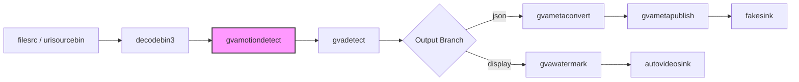

# Motion Detect Sample (gst-launch command line)

This README documents the Windows `gvamotiondetect_demo.bat` script, a simple way to run the `gvamotiondetect` element in a GStreamer pipeline, additionally chaining `gvadetect` over motion ROIs.

## How It Works

The script builds and runs a GStreamer pipeline with `gst-launch-1.0`. It supports CPU inference and accepts a local file or URI source.

Key elements in the pipeline:
- `urisourcebin` or `filesrc` + `decodebin3`: input and decoding
- `gvamotiondetect`: motion region detection (ROI publisher)
- `gvadetect`: runs object detection restricted to motion ROIs (`inference-region=1`)
- Output:
  - `gvametaconvert` + `gvametapublish`: write metadata to `output.json` (JSON Lines)
  - or `autovideosink`: on-screen rendering with FPS counter

## Pipeline Architecture

This pipeline demonstrates DL Streamer motion detection workflow: gvamotiondetect acts as a spatial-temporal filter to identify movement, triggering gvadetect (YOLOv8n) only when necessary to optimize compute resources.



## Models

The sample uses YOLOv8n (resolved via `MODELS_PATH`) or other supported object detection model with the OpenVINO™ format.

## Usage

The batch script uses positional arguments (not `--param` flags).

```bat
gvamotiondetect_demo.bat [DEVICE] [SOURCE] [MODEL] [PRECISION] [BACKEND] [OUTPUT] [MD_OPTS]
```

- `DEVICE`: Currently only support `CPU`. Default: `CPU`.
- `SOURCE`: Local file path or URI. Use `DEFAULT` (or `.` / empty) to use the built-in sample HTTPS video.
- `MODEL`: Optional OpenVINO XML model path. Use `.` or empty to resolve from `MODELS_PATH`.
- `PRECISION`: `FP32` / `FP16` / `INT8`. Default: `FP32`.
- `BACKEND`: Pre-process backend for `gvadetect` (e.g., `opencv`). Default: `opencv`.
- `OUTPUT`: `display` (default) or `json`.
- `MD_OPTS`: Extra properties for `gvamotiondetect`, space-separated (e.g., `"motion-threshold=0.07 min-persistence=2"`).

Notes:
- The script defaults to `MODEL_NAME=yolov8n` and converts backslashes in `SOURCE` and model paths to forward slashes for GStreamer.

## Examples

- CPU path with default source and model:
```bat
set MODELS_PATH=C:\models
gvamotiondetect_demo.bat CPU . . FP32 opencv display
```
- CPU path with local file, display output, and custom motion detector options:
```bat
set MODELS_PATH=C:\models
gvamotiondetect_demo.bat CPU C:\path\to\video.mp4 . FP32 opencv display "motion-threshold=0.07 min-persistence=2"
```
- Explicit model path:
```bat
gvamotiondetect_demo.bat CPU C:\path\to\video.mp4 C:\path\to\models\yolov8n.xml FP32 opencv json
```

## Motion Detector Options (`--md-opts`)

`MD_OPTS` lets you pass properties directly to the `gvamotiondetect` element. Provide them as a space-separated list in quotes:

```bat
"motion-threshold=0.07 min-persistence=2"
```

- `motion-threshold`: Float in [0..1]. Sensitivity of motion detection; lower values detect smaller changes, higher values reduce false positives. Example: `0.05` (more sensitive) vs `0.10` (less sensitive).
- `min-persistence`: Integer ≥ 0. Minimum number of consecutive frames a region must persist to be reported as motion. Helps filter out transient noise.
- Other properties: You can pass any supported `gvamotiondetect` property the element exposes (e.g., ROI size or smoothing controls, if available in your build). Use `gst-inspect-1.0 gvamotiondetect` to list all properties and defaults.

Tip: Start with `motion-threshold=0.07` and `min-persistence=2`, then adjust based on scene noise and desired sensitivity.

## Output

- JSON mode: writes metadata to `output.json` (JSON Lines) and prints FPS via `gvafpscounter`.
- Display mode: renders via `autovideosink`.
