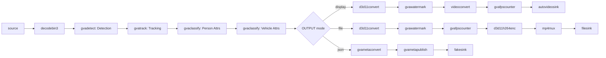

# Vehicle and Pedestrian Tracking Sample (Windows)

This sample demonstrates object detection, tracking, and classification pipeline on Windows using DL Streamer.

## How It Works

The sample builds a GStreamer pipeline using:
- `filesrc` or `urisourcebin` for input
- `decodebin3` for video decoding
- [gvadetect](https://dlstreamer.github.io/elements/gvadetect.html) for object detection (person, vehicle, bike)
- [gvatrack](https://dlstreamer.github.io/elements/gvatrack.html) for object tracking across frames
- [gvaclassify](https://dlstreamer.github.io/elements/gvaclassify.html) (2x) for person and vehicle attribute classification
- [gvawatermark](https://dlstreamer.github.io/elements/gvawatermark.html) for visualization
- `d3d11convert` for D3D11-accelerated video processing

## Models

The sample uses the following pre-trained models from OpenVINO™ Toolkit [Open Model Zoo](https://github.com/openvinotoolkit/open_model_zoo):
- **person-vehicle-bike-detection-2004** - Object detection
- **person-attributes-recognition-crossroad-0230** - Person attributes (is_male, has_bag, has_hat, etc.)
- **vehicle-attributes-recognition-barrier-0039** - Vehicle attributes (color, type)

> **NOTE**: Run `download_omz_models.bat` once before using this sample.

## Environment Variables

```batch
set MODELS_PATH=C:\models
```

## Running

```batch
vehicle_pedestrian_tracking.bat [INPUT] [DETECTION_INTERVAL] [DEVICE] [OUTPUT] [TRACKING_TYPE] [JSON_FILE]
```

Arguments:
- **INPUT** - Input source (default: GitHub sample video)
- **DETECTION_INTERVAL** - Detection frequency (default: 3)
  - `1` = detect every frame
  - `3` = detect every 3rd frame (tracking fills gaps)
  - Higher value = better performance, lower accuracy
- **DEVICE** - Inference device (default: AUTO)
  - Supported: AUTO, CPU, GPU, GPU.0
- **OUTPUT** - Output type (default: display)
  - `display` - Synchronous display
  - `display-async` - Fast async display
  - `fps` - Print FPS only
  - `json` - Export metadata
  - `display-and-json` - Both
  - `file` - Save to MP4
- **TRACKING_TYPE** - Tracking algorithm (default: short-term-imageless)
  - `short-term-imageless` - Fast, appearance-free tracking
  - `zero-term` - Detection-only (no tracking)
  - `zero-term-imageless` - Simplified zero-term
- **JSON_FILE** - JSON output filename (default: output.json)

## Examples

### Detect every 3rd frame with tracking on GPU
```batch
vehicle_pedestrian_tracking.bat C:\videos\traffic.mp4 3 GPU display-async
```

### High-accuracy mode (detect every frame)
```batch
vehicle_pedestrian_tracking.bat C:\videos\traffic.mp4 1 AUTO display
```

### Export tracking data to JSON
```batch
vehicle_pedestrian_tracking.bat C:\videos\traffic.mp4 3 GPU json tracking_results.json
```

### Performance benchmark
```batch
vehicle_pedestrian_tracking.bat C:\videos\traffic.mp4 5 GPU fps
```

## Pipeline Architecture



## Key Features

### Object Tracking
The `gvatrack` element maintains object identities across frames:
- Assigns unique IDs to tracked objects
- Works even when detection is skipped (via `detection-interval`)
- Reduces computational cost while maintaining accuracy

### Reclassification Interval
Classification models run every 10th frame (configurable):
- Reduces redundant attribute inference
- Tracking maintains attributes between classifications

### Detected Attributes

**Person:**
- Gender (is_male)
- Accessories (has_bag, has_hat, has_backpack)

**Vehicle:**
- Type (car, bus, truck, van)
- Color

## Performance Tips

1. **Increase detection interval** (3-10) for better FPS
2. **Use GPU device** for parallel inference
3. **Use `zero-term-imageless` tracking** if detection interval is 1
4. **Reduce video resolution** for faster processing

## Troubleshooting

### Low FPS
- Increase `DETECTION_INTERVAL` to 5 or higher
- Switch to GPU device
- Use smaller input resolution

### Missing detections
- Decrease `DETECTION_INTERVAL` to 1 or 2
- Adjust detection threshold in the pipeline

### Track ID switches
- Use `short-term-imageless` tracking type
- Decrease `DETECTION_INTERVAL`
