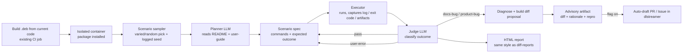

# AI User-Simulation Agent for DL Streamer — Design

> Status: DESIGN / proposal. No implementation yet.
> Home repo: **dlstreamer** (this repo). All agent code, CI wiring, and any drafted
> PRs/Issues target this repository.
> Goal: raise product quality and speed up validation by using an LLM agent that
> behaves like a real DL Streamer user, exercises **varied, arbitrarily chosen**
> scenarios against a **`.deb` built from the current code**, and proposes fixes
> when something breaks.

---

## 1. Goals and non-goals

### Goals
- **Always test current code.** The agent runs against a `.deb` freshly built from the
  branch/commit under test, reusing the existing CI build (no separate build path).
- **Behave like a user, pick varied things.** The agent does not replay one fixed list.
  On each weekly run it **samples a diverse, randomized set** of scenarios across all
  sources — that unpredictability is the point: it mimics how different users poke at
  different features over time and surfaces problems a fixed suite would never hit.
- **Read instructions like a user.** It derives scenarios from *documentation*: sample
  `README.md` files and `docs/user-guide/**`, then reacts to failures the way a person
  would (inspect elements, fetch a missing model, retry a variant).
- **Verify docs actually work.** Catch documentation↔code drift (wrong element name, missing
  flag, renamed model, stale env var) — a class of bug seen repeatedly in past README audits.
- **Propose changes.** When a problem is found, produce a concrete, reviewable proposal:
  a `git diff` + rationale, optionally an **auto-drafted PR or GitHub Issue behind a flag**.
- **Reuse existing infra.** Build on the diff-report HTML styling, the AI-verdict/GT-update
  script patterns, and the existing functional-test CI wiring.

### Non-goals
- Not a replacement for the deterministic config-driven functional tests. The agent is
  *complementary*: exploratory, varied coverage — not fixed regression GT.
- Not auto-merging anything. Proposals are advisory by default; PR/Issue creation is opt-in
  behind an explicit flag + token.
- No model fine-tuning; the agent is prompt/tooling driven.

---

## 2. High-level architecture



The loop is: **sample → plan → run → observe → judge → (retry | propose) → report.**

---

## 3. Components

New code lives under `tests/ai_agent/` in the dlstreamer repo (next to `tests/unit_tests/`),
kept out of the deterministic functional-test path.

```
tests/ai_agent/
  DESIGN.md                 # this file
  agent/
    __init__.py
    config.py               # model provider, flags, budgets, allowlists, RNG seed
    llm_client.py           # external-API abstraction (OpenAI/Azure), retry, cost cap
    scenario_miner.py       # extract runnable scenarios from README + user-guide
    scenario_sampler.py     # varied/random selection across all mined scenarios
    planner.py              # LLM: turn a scenario/goal into a concrete plan (commands)
    executor.py             # run commands in the container; capture logs/exit/artifacts
    judge.py                # LLM: classify outcome (reuses ai_verdict.py patterns)
    proposer.py             # build git diff + rationale; optional PR/Issue draft
    retry.py                # 'act like a user' retry loop on user-error launches
    report.py               # HTML report (reuses diff-report styling)
    run_agent.py            # CLI entry point / orchestrator
  prompts/
    planner.md
    judge.md
    proposer.md
  scenarios/
    seed_scenarios.yaml     # optional curated NL goals to mix into the random pool
```

### 3.1 Scenario miner (`scenario_miner.py`)
- Sources (crawl **all** of them, no fixed subset):
  - **Sample READMEs**: `samples/**/README.md` — extract fenced ```bash``` blocks, required env
    vars (`MODELS_PATH`, `VIDEO_INPUTS_PATH`, etc.), and prose claims ("writes JSON per frame",
    "runs full-frame inference").
  - **User guide**: `docs/user-guide/**` — extract command examples and documented behavior; each
    becomes a *contract*: "docs claim X → run → verify X".
- Output: a normalized `Scenario` object (source path, raw command(s), env requirements,
  expected-outcome hints, difficulty). Deterministic parse first; LLM only to interpret prose
  claims into checkable assertions.
- **Setup vs launch grouping (prerequisite chaining).** Each fenced block is classified as
  `launch` (runs the product: `gst-launch-1.0`/`gst-inspect-1.0`, a `./script`, or `python ./x.py`),
  `setup` (prepares prerequisites: `wget`/`curl`/`download_*`/`pip install`/`apt`/`source setupvars`,
  or a pure `export`/`cd` block), or skipped. One scenario is emitted **per launch block**, with all
  preceding setup blocks in the same document chained ahead of it as setup steps — so a launch that
  needs a model/video isn't run before the block that fetches it. Template blocks containing
  unresolved `<...>` placeholders are dropped as non-runnable.

### 3.2 Scenario sampler (`scenario_sampler.py`)
- Takes the full mined pool and picks a **diverse, randomized** subset for the run — the
  behavior the user asked for ("take varied things, like a real user would").
- Diversity strategy: stratify so a run spans different categories (detection, classification,
  tracking, audio, VLM/LVM, Python vs CLI vs C++), then randomize within/across strata so no
  two weekly runs look the same. Fits within the per-run budget (see §4).
- **Reproducibility**: the RNG seed is logged in the report so any run can be replayed exactly.

### 3.3 Planner (`planner.py`)
- Modes:
  - **Doc-grounded** (primary): take a sampled scenario, resolve prerequisites (download model,
    locate a sample video), produce an executable plan.
  - **Free NL goal** (later phase): given only a goal like "vehicle detection + tracking → JSON",
    compose a pipeline from elements discovered via `gst-inspect-1.0`.
- Emits a `Plan`: ordered steps, each a shell command with a timeout, working dir, and the
  assertion(s) that define success.

### 3.4 Executor (`executor.py`)
- Runs each scenario's commands (setup blocks + launch) as **one shell session** (`bash -c` with the
  lines joined), so `source setup_dls_env.sh`, `export MODELS_PATH=...` and `cd` persist across them
  — exactly like a user running the block. The exit code is the last (launch) command's, and the
  combined log carries any setup errors as context for the judge.
- Captures: stdout/stderr, exit code, wall time. Truncates/streams large logs.
- **Safety by denylist, not allowlist.** Documented commands come from the trusted repo under test,
  so instead of allowlisting binaries (which blocked legit tools like `pip`/`git`), the executor
  only refuses a small set of clearly destructive patterns (`rm -rf /`~/*, `mkfs`, `dd if=`,
  `shutdown`/`reboot`, fork bombs, `curl|sh`, writes to `/dev/sd`). `stdin` is `/dev/null` so `sudo`
  or other prompts fail fast instead of hanging. The real containment boundary is the isolated CI
  container. LLM-proposed retry commands pass through the same denylist.

### 3.5 Judge (`judge.py`)
- Reuses the approach from the existing AI-verdict tooling (a vision-capable model can inspect
  output frames/video too). Classifies each outcome into:
  - `pass` — behavior matches the documented claim.
  - `user-error` — the agent built the pipeline wrong / missing prerequisite; **retry**, file
    nothing. This category is what keeps LLM/randomization flakiness out of the bug reports.
  - `docs-bug` — command/claim in the docs is wrong for the current code → propose a docs fix.
  - `product-bug` — documented usage is correct but the product misbehaves/crashes → propose a
    code fix or file an Issue with a minimal repro.
  - `flaky` — non-deterministic; re-run N times before deciding.
- Because setup and launch run in one shell, a failed prerequisite (missing model/video, failed
  download) surfaces in the combined log and is judged `user-error`, so it is never mis-reported as
  a product defect.
- **Retry loop (`retry.py`).** While a launch is judged `user-error` and budget/retries remain, the
  LLM is asked to propose one corrected command (fix a flag/element name, add a missing model or
  video path) and the launch is re-run — exactly what a real user does. Setup steps are reused, not
  re-proposed. If the fix looks correct yet it still fails, that is stronger evidence of a real
  docs/product bug. `--max-retries` (default 2) caps the loop; offline runs skip it (no LLM). The
  final attempt count is recorded in the verdict evidence.
- Output: a structured `Verdict` JSON (category, confidence, evidence, minimal repro).

### 3.6 Proposer (`proposer.py`)
- For `docs-bug`: generate a `git diff` against the offending README/user-guide file.
- For `product-bug`: attach the minimal repro + logs; optionally an LLM-suggested code diff
  (clearly marked "unverified suggestion").
- **Autonomy is flag-gated** (per decision):
  - default: write the diff + rationale to the report artifact only (advisory).
  - `--open-pr` (or `AI_AGENT_OPEN_PR=1`): auto-draft a PR **against the dlstreamer repo** for
    docs fixes; requires a fine-grained PAT secret.
  - `--open-issue`: file a GitHub Issue in the dlstreamer repo with the repro for `product-bug`.
- All auto-created PRs/Issues are labeled (e.g. `ai-agent`, `needs-human-review`) and never merge.

### 3.7 Report (`report.py`)
- Produces a browsable HTML report in the same visual family as the existing diff-reports,
  summarizing: RNG seed, scenarios sampled, per-scenario verdict, evidence (log excerpts, frames),
  and links to any drafted PR/Issue. One combined artifact per run.

---

## 4. LLM provider (GitHub Models)

- `llm_client.py` talks to **GitHub Models** — the same models Copilot uses — via its
  OpenAI-compatible endpoint (`https://models.github.ai/inference`), so the OpenAI SDK is reused.
  This is the **only** supported back-end.
- Model: **`openai/gpt-4o`** (multimodal, so the judge can inspect output frames).
- Auth is a **GitHub token**, not an OpenAI key, passed via the secret `AI_AGENT_LLM_API_KEY`:
  - **CI**: the built-in `GITHUB_TOKEN` with `permissions: models: read` — no PAT needed.
  - **Local**: a fine-grained PAT with account permission `Models: read`.
- The key is never logged and never routed through non-secret env expansion. Quota is rate/credit
  based, which maps naturally onto the 500-credit budget.
- Guardrails:
  - **Cost cap: 500 credits per weekly run** (default). The sampler is budget-aware — it picks as
    many varied scenarios as fit within 500 credits rather than running the whole doc corpus, and
    logs actual consumption in the report. Roughly a dozen to ~30 scenarios per run with `gpt-4o`
    (fewer when the judge uses vision on output frames). Raise the cap or gate vision behind
    suspected-failure only if this proves too small.
  - **Deterministic-first**: parse what can be parsed without the LLM; call the model only for
    interpretation, planning, judging, and diff drafting.
  - **Prompt-injection defense**: README/user-guide content is untrusted input; the planner/judge
    prompts treat doc text as data, not instructions. The executor allowlist is the real safety
    boundary — LLM output can never execute outside it.

---

## 5. Freshness & CI wiring

- **Schedule: weekly, Wednesday afternoon**, plus manual trigger. Following this repo's existing
  weekly-workflow conventions (`dls-weekly-cached-images.yaml`):

  ```yaml
  on:
    schedule:
      - cron: '0 13 * * WED'   # 13:00 UTC each Wednesday (afternoon CET)
    workflow_dispatch:
  permissions: {}
  ```

  A new workflow (e.g. `.github/workflows/dls-weekly-ai-agent.yaml`) that: builds/obtains the
  `.deb` from current code (reuse the existing build path), installs it into a clean container,
  runs `tests/ai_agent/agent/run_agent.py`, and uploads one combined HTML+diff artifact.
- Secrets provided at the job level: `AI_AGENT_LLM_API_KEY` (required), `AI_AGENT_PR_PAT`
  (only for the opt-in auto-PR/Issue path). Default runs create no PRs.
- `runs-on: dlstreamer` (self-hosted label used by the other DLS workflows).

---

## 6. Data model (sketch)

```jsonc
// Scenario
{ "id": "samples/gstreamer/gst_launch/vehicle_pedestrian_tracking",
  "source": "samples/.../README.md",
  "category": "tracking",
  "commands": ["MODELS_PATH=... ./vehicle_pedestrian_tracking.sh ..."],
  "env_requirements": ["MODELS_PATH", "VIDEO_INPUTS_PATH"],
  "expected": ["exit 0", "produces JSON with objects[].detection", "one gvatrack in pipeline"] }

// Verdict
{ "scenario_id": "...",
  "category": "docs-bug | product-bug | user-error | flaky | pass",
  "confidence": 0.0,
  "evidence": { "exit_code": 1, "log_excerpt": "...", "frames": ["f012.png"] },
  "repro": ["..."],
  "proposal": { "type": "docs-diff", "path": "...README.md", "diff": "..." } }
```

---

## 7. Security

- Everything runs in an **isolated CI container**; no network egress except model/video download
  from known hosts (allowlisted).
- **Denylist** in the executor refuses destructive commands (`rm -rf /`, `mkfs`, `dd`, `shutdown`,
  fork bombs, `curl|sh`, …); `stdin` is `/dev/null` so interactive prompts can't hang. The isolated
  container is the real containment boundary.
- Secrets only via CI secret store; auto-PR/Issue requires an explicit fine-grained PAT and is
  off by default.
- Doc text is untrusted → treated as data by the LLM; safety enforced by the executor allowlist,
  not by trusting model output.

---

## 8. Phased roadmap

- **Phase 0 — PoC.** `run_agent.py` samples a small varied set from mined README/user-guide
  scenarios, executor + deterministic checks, LLM judge, HTML report. No PR automation.
- **Phase 1 — Sampler + doc-grounded planner + retry.** Full mining of all sample READMEs and
  user-guide; stratified/randomized sampling; "act like a user" retry loop; `user-error` vs
  real-bug separation. *(Done: setup/launch grouping with prerequisite chaining; setup failures
  classified as user-error; LLM-guided retry loop on user-error launches.)*
- **Phase 2 — Proposals (advisory).** `docs-diff` proposals in the artifact; `product-bug` repros.
- **Phase 3 — CI + opt-in automation.** Add the weekly Wednesday workflow; enable `--open-pr` /
  `--open-issue` behind flags + secrets.
- **Phase 4 — Free NL goals.** Agent composes pipelines from `gst-inspect` for undocumented paths.

---

## 9. Decisions & open questions

Resolved:
- Home repo: **dlstreamer**; drafted PRs/Issues target this repo.
- Schedule: **weekly, Wednesday 13:00 UTC** (`cron: '0 13 * * WED'`) + `workflow_dispatch`.
- Secret names: **`AI_AGENT_LLM_API_KEY`** (required) and **`AI_AGENT_PR_PAT`** (opt-in PR/Issue).
- Cost budget: **500 credits per run** (budget-aware sampler, consumption logged).
- LLM provider: **GitHub Models only** (`https://models.github.ai/inference`, model
  `openai/gpt-4o`). Auth via GitHub token in `AI_AGENT_LLM_API_KEY` (CI `GITHUB_TOKEN` +
  `models: read`; local fine-grained PAT with `Models: read`).

Open:
1. Which existing build path to reuse to obtain the `.deb` for the agent job.
```
